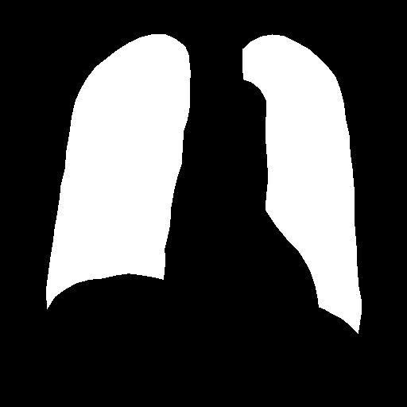
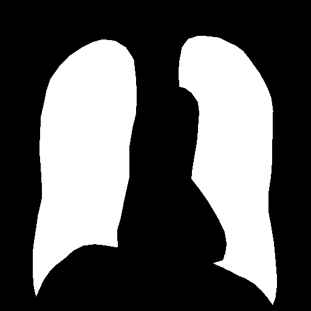
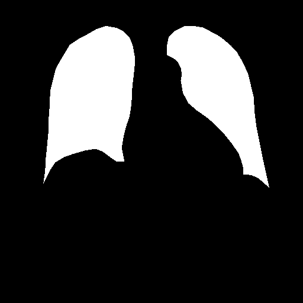
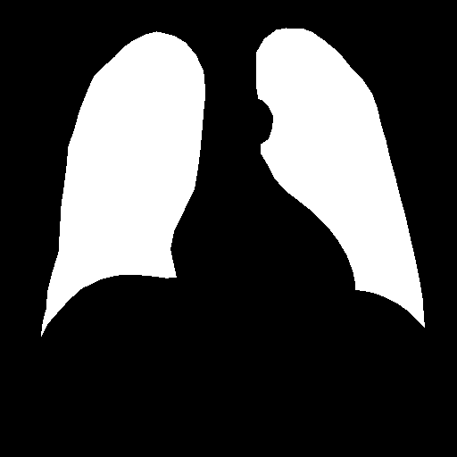

# CXR Lung Segmentation Using U-Net

This implementation utilizes the [U-Net](https://github.com/imlab-uiip/lung-segmentation-2d) for
lung segmentation.

## Requirements

The script requires the following Python modules:

| Module | Description|
| --- | --- |
| [`SimpleITK`](https://pypi.org/project/SimpleITK/) | `SimpleITK` is an image analysis toolkit with a large number of components supporting general filtering operations, image segmentation and registration. |
| [`keras`](https://keras.io/) | `keras` offers consistent and simple APIs that minimizes actions required for common use cases, and it provides clear & actionable error messages. |
| [`scikit-image`](https://scikit-image.org/) | `scikit-image` is a collection of algorithms for image processing. |

Note: `keras` may require `tensorflow` installed.

## Usage

To run the script with the sample image file, simply type the command:

```python
python3 run_segment.py -i example.png -m 4-mask.png
```

If the run completes successfully, you should get two output images, `lung.left.png` and `lung.right.png`.

| Left Lung Segment | Right Lung Segment |
| --- | --- |
|  |  |

The implementation utilizes the standard Python library `argparse` for command line arguments. To see the
help text, simply type `python3 run_segment.py -h`. You should see the help text below.

```python
usage: run_segment.py [-h] --input INPUT [--mask MASK]

Lung segmentation refers to the process of accurately identifying regions and boundaries of the lung field from surrounding
thoracic tissue. It is an essential first step in pulmonary image analysis of many clinical decision support systems. This
implementation utilizes the U-Net (https://github.com/imlab-uiip/lung-segmentation-2d) for lung segmentation.

options:
  -h, --help            show this help message and exit
  --input INPUT, -i INPUT
                        [Required] Lung image to be segmented.
  --mask MASK, -m MASK  [Optional] Lung segmentation mask. The default value is 4-mask.png.
```

The script requires a lung image (in PNG or JPG format) and an image mask as input. There are currently
four image masks (see below).

|  |  |
| --- | --- |
|  |  |

## Synopsis

There are 6 implementations for the lung segmentation, namely lung, bounding box, and block using the
[U-Net convolutional networks](https://arxiv.org/abs/1505.04597). The algorithm generates a single segmentation
mask or paired for left and right lungs. The trained model is stored in the file `trained_model.hdf5`. U-Net
consists of Convolution Operation, Max Pooling, ReLU Activation, Concatenation and Up Sampling Layers and three
sections: contraction, bottleneck, and expansion section. the contractions section has 4 contraction blocks.
Every contraction block gets an input, applies two 3X3 convolution ReLu layers and then a 2X2 max pooling. The
number of feature maps gets double at each pooling layer. The bottleneck layer uses two 3X3 convolution layers
and 2X2 up convolution layer. The expansion section consists of several expansion blocks with each block
passing the input to two 3X3 convolution layers and a 2X2 upsampling layer that halves the number of feature
channels. It also includes a concatenation with the correspondingly cropped feature map from the contracting
path. In the end, 1X1 convolution layer is used to make the number of feature maps as same as the number of
segments which are desired in the output. U-net uses a loss function for each pixel of the image. This helps in
easy identification of individual cells within the segmentation map. Softmax is applied to each pixel followed
by a loss function. This converts the segmentation problem into a classification problem where we need to
classify each pixel to one of the classes.

The difference between convolutional neural network and U-Net is that, in CNN, the image is converted into a
vector which is largely used in classification problems. But in U-Net, an image is converted into a vector and
then the same mapping is used to convert it again to an image. This reduces the distortion by preserving
the original structure of the image.
